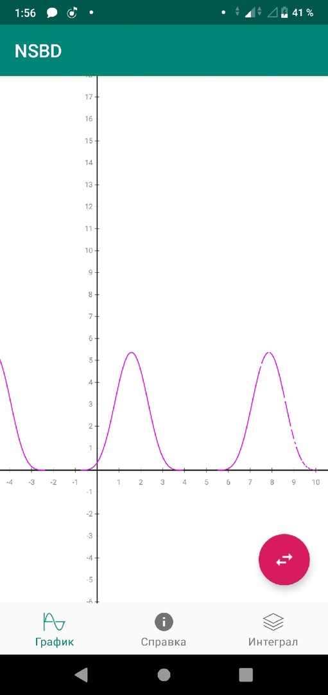
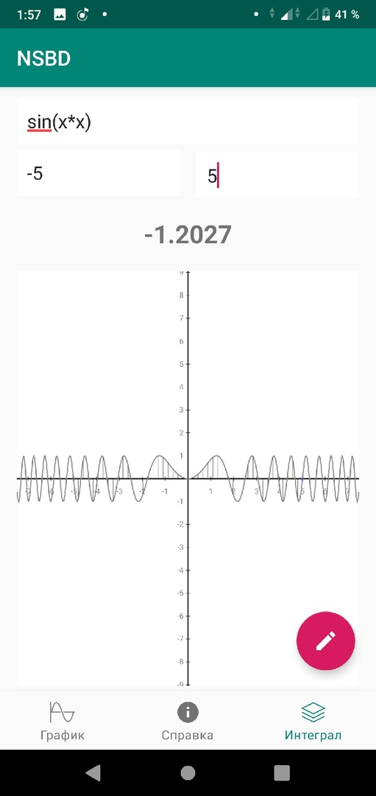

# NSBD
Приложение для платформы Android для отображения графиков наиболее популярных триганометрических функций и вычисления их интегралов
  
поддерживаемые функции:
1. +
2. -
3. *
4. /
5. ^ (возведение в степень)
6. sin(x)
7. cos(x)
8. tx(x)
9. ctg(x)
10. sqrt(x)
11. abs(x)
12. asin(x)
13. acos(x)
14. atg(x)
15. ln(x)
16. lg(x)
17. log(g(x);f(x))
## Пример:
    y = (sin(x) + cos(pi / 4)) ^ pi
## Поддерживаемые константы:
    1. Число Пи pi = 3.1415
    2. Число Эйлера e = 2.7182